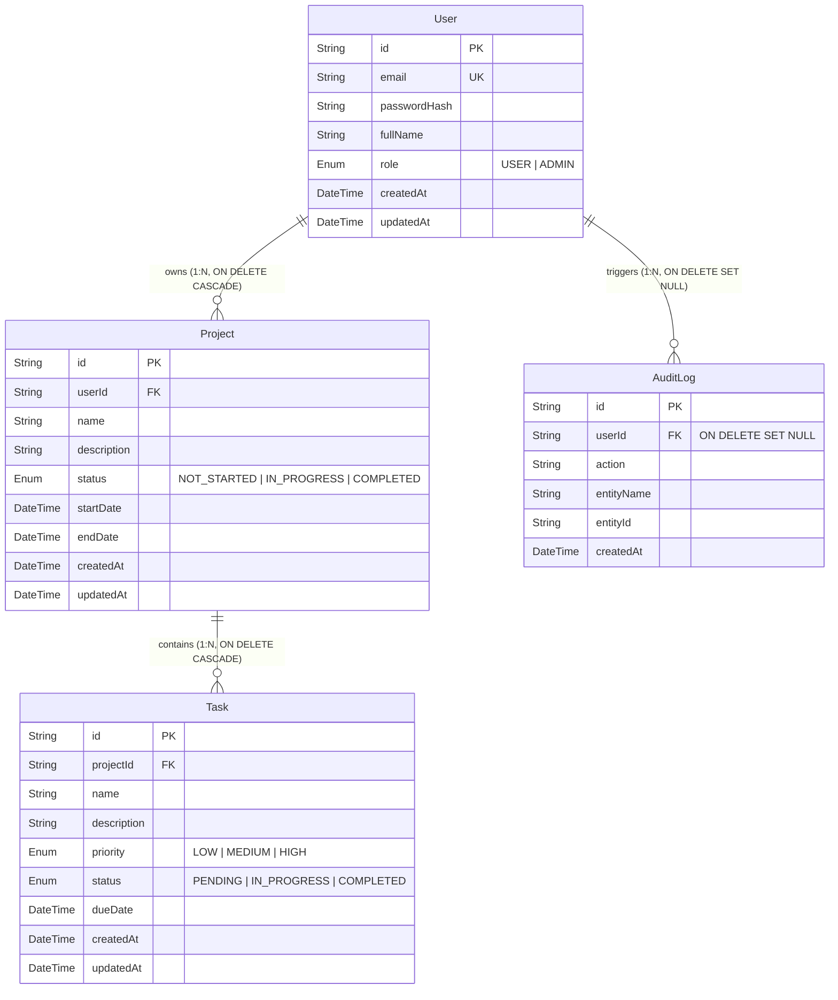

# Entity-Relationship Diagram

This system uses a normalized PostgreSQL schema with Prisma ORM.

## Relationships

1. **User → Project**: A user can create and own multiple projects. A project strictly belongs to exactly one user.
2. **Project → Task**: A project contains multiple tasks. If a project is deleted, its tasks are automatically cascade-deleted.
3. **User → AuditLog**: System actions (Create/Update/Delete) generate audit logs tied to the user performing the action. If a user is deleted, their associated audit logs nullify the `userId` to retain historical context without violating foreign key constraints.

